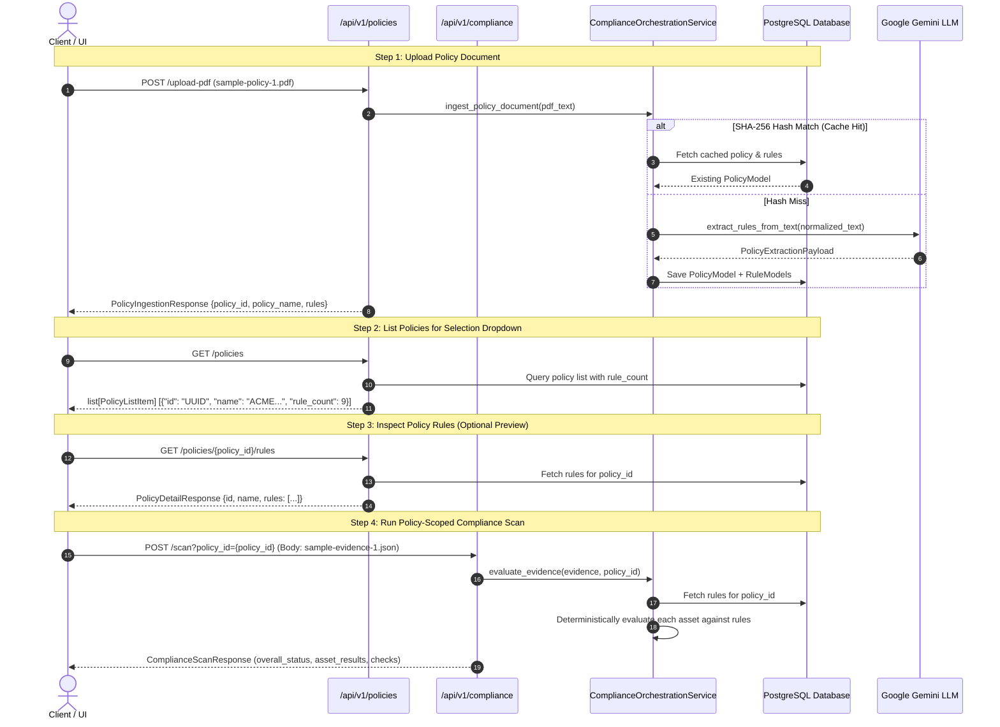

# API Version 1 (`app/api/v1/`)

This directory contains version 1 REST API endpoints for policy ingestion, AI rule extraction, policy listing/selection, and deterministic cloud compliance scanning.

---

## 📋 API Specification Summary

| Method | Endpoint | Purpose | Request Body / Params | Response Payload |
|---|---|---|---|---|
| `POST` | `/api/v1/policies/upload-pdf` | Uploads PDF, extracts text, runs LLM rule extraction, deduplicates via SHA-256, and persists to PostgreSQL. | `multipart/form-data` (`file`) | `PolicyIngestionResponse` |
| `POST` | `/api/v1/policies/extract-text` | Extracts and saves rules directly from raw pasted text (fast testing). | `{"policy_name": str, "raw_text": str}` | `PolicyIngestionResponse` |
| `GET` | `/api/v1/policies` | Lists all ingested policies and active rule counts for UI selectors. | None | `list[PolicyListItem]` |
| `GET` | `/api/v1/policies/{policy_id}/rules` | Fetches extracted rules for a specific policy for UI review. | `policy_id` (Path UUID) | `PolicyDetailResponse` |
| `POST` | `/api/v1/compliance/scan` | Ingests AWS/Cloud evidence JSON and computes deterministic compliance. | `EvidencePayload` + optional `?policy_id={uuid}` | `ComplianceScanResponse` |
| `GET` | `/health` | Health check verifying database connection pool. | None | `{"status": "healthy", "database": "connected"}` |

---

## 🔄 End-to-End Workflow



---

## 🚀 Step-by-Step Usage Guide

### 1. Ingesting Policy Document (`POST /api/v1/policies/upload-pdf`)
Upload a PDF policy document (e.g. `docs/sample-policy-1.pdf`):
```bash
curl -X POST "http://localhost:8000/api/v1/policies/upload-pdf" \
  -F "file=@docs/sample-policy-1.pdf;type=application/pdf"
```
**Response (`201 Created`)**:
```json
{
  "policy_id": "aa442cb7-09e7-4dab-98a9-388116886ae1",
  "policy_name": "ACME Cloud Infrastructure Security & Governance Policy",
  "rules": [
    {
      "control_id": "SEC-S3-001",
      "title": "Data Encryption",
      "target_asset_type": "s3_bucket",
      "target_metric": "server_side_encryption",
      "operator": "in",
      "threshold_value": ["aws:kms", "AES256"],
      "source_clause": "All Amazon S3 storage buckets must enforce server-side encryption with AWS KMS or AES-256.",
      "page_number": 1,
      "pre_condition": null
    }
  ]
}
```

### 2. Selecting Ingested Policies (`GET /api/v1/policies`)
Fetch all policies to populate the selection dropdown on the dashboard:
```bash
curl -X GET "http://localhost:8000/api/v1/policies"
```
**Response (`200 OK`)**:
```json
[
  {
    "id": "aa442cb7-09e7-4dab-98a9-388116886ae1",
    "name": "ACME Cloud Infrastructure Security & Governance Policy",
    "created_at": "2026-08-21T16:00:00Z",
    "rule_count": 9
  }
]
```

### 3. Reviewing Extracted Rules (`GET /api/v1/policies/{policy_id}/rules`)
Retrieve the complete rule list for a specific policy UUID:
```bash
curl -X GET "http://localhost:8000/api/v1/policies/aa442cb7-09e7-4dab-98a9-388116886ae1/rules"
```

### 4. Running a Compliance Audit (`POST /api/v1/compliance/scan`)
Execute the deterministic compliance evaluation against the selected policy by providing `policy_id`:
```bash
curl -X POST "http://localhost:8000/api/v1/compliance/scan?policy_id=aa442cb7-09e7-4dab-98a9-388116886ae1" \
  -H "Content-Type: application/json" \
  -d @docs/sample-evidence-1.json
```
**Response (`200 OK`)**:
```json
{
  "scan_id": "audit-scan-2026-08-prod-01",
  "environment": "production",
  "overall_status": "Non-Compliant",
  "total_assets": 6,
  "compliant_assets_count": 4,
  "non_compliant_assets_count": 2,
  "asset_results": [ ... ]
}
```
